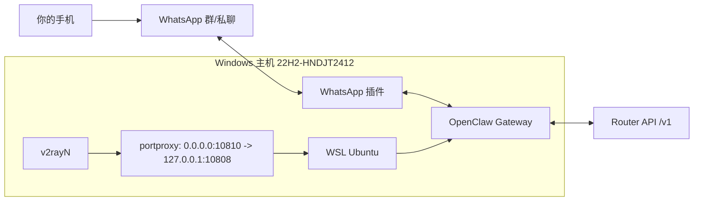
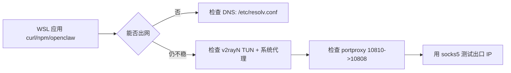
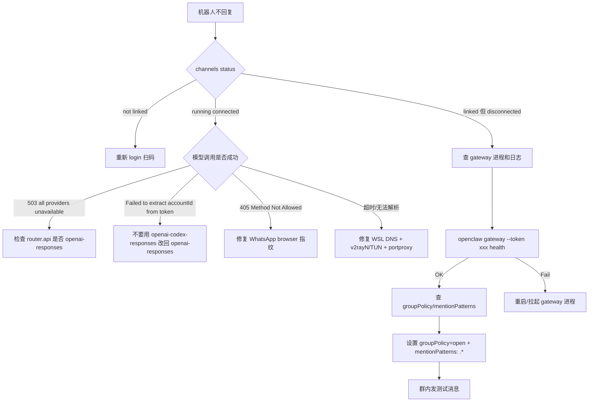
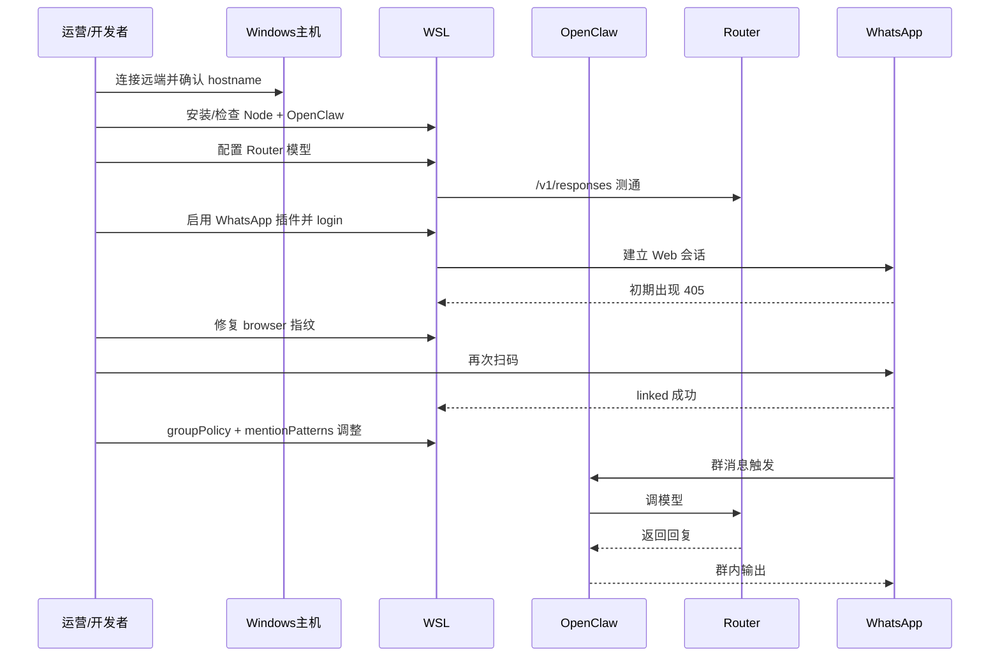

# OpenClaw WhatsApp 群聊机器人实战手册（从 0 到可用）

> 教师 + 指挥官视角：不只告诉你“怎么做”，更告诉你“为什么这样做”。
> 
> 目标：在 **Windows（国内网络）+ WSL + OpenClaw** 环境下，让机器人稳定加入 WhatsApp 群并可对话，模型走公司 Router 的 `gpt-5.3-codex`。

---

## 1. 你会拿到什么结果

完成本文后，你会拿到一套可复用成果：

- WhatsApp 账号已被 OpenClaw 成功 `linked + running + connected`
- OpenClaw 模型调用走 `https://test-router.yeying.pub/v1`
- 群聊策略可配置（默认建议：群可回复、私聊保持配对模式）
- 碰到 405 / 502 / 503 / not linked / stopped 等问题，有明确排障路径

---

## 2. 全局架构（先看地图，再打仗）



核心关系一句话：

- **OpenClaw** 负责“会话编排”
- **WhatsApp 插件** 负责“收发消息”
- **Router** 负责“模型推理”
- **v2rayN + WSL 网络修正** 负责“让链路在国内网络里稳定跑起来”

---

## 3. 先定战场：避免连错机器（第一个大坑）

### 3.1 坑现象

你以为在 `cnwin-admin-via-vps`，实际跑到了别的 Windows 主机（比如 `DESKTOP-SHDD92E`），导致：

- 你看到“WSL 没安装”
- 但实际上你在错误主机上检查

### 3.2 正确验证命令

在本地 Linux（你的 codex 终端）执行：

```bash
ssh cnwin-admin-via-vps "hostname"
```

预期应为：

```text
22H2-HNDJT2412
```

> 教师提示：**每次开工先看 hostname**，这是远程运维最便宜也最值钱的一步。

---

## 4. 网络是生命线：v2rayN + WSL 打通方案（重点）

这一章是最关键的“基础设施篇”。

### 4.1 你要理解的原理（简版）

1. v2rayN 默认监听 Windows 本地回环（如 `127.0.0.1:10808`）。
2. WSL 里的 `127.0.0.1` 不是 Windows 的 `127.0.0.1`。
3. 所以“Windows 上代理可用，不代表 WSL 自动可用”。

### 4.2 推荐配置路径（两层保险）

- 第一层：在 v2rayN 打开
  - **自动配置系统代理**
  - **TUN 模式**
- 第二层（实战有效）：给 WSL 增加端口桥
  - `0.0.0.0:10810 -> 127.0.0.1:10808`

### 4.3 Windows 侧命令（管理员 PowerShell/CMD）

```powershell
# 查看当前 portproxy
netsh interface portproxy show v4tov4

# 新增桥接（已存在会报冲突，先删再加）
netsh interface portproxy delete v4tov4 listenaddress=0.0.0.0 listenport=10810
netsh interface portproxy add v4tov4 listenaddress=0.0.0.0 listenport=10810 connectaddress=127.0.0.1 connectport=10808

# 再查一次
netsh interface portproxy show v4tov4
```

预期关键行：

```text
0.0.0.0  10810  127.0.0.1  10808
```

### 4.4 WSL DNS 修复（第二个大坑）

坑现象：WSL 偶发无法解析域名，`curl`、`npm`、`openclaw` 各种超时。

在 WSL 执行：

```bash
sudo tee /etc/wsl.conf >/dev/null <<'CFG'
[network]
generateResolvConf = false
CFG

sudo rm -f /etc/resolv.conf
sudo tee /etc/resolv.conf >/dev/null <<'DNS'
nameserver 1.1.1.1
nameserver 8.8.8.8
DNS
```

验证：

```bash
cat /etc/wsl.conf
cat /etc/resolv.conf
```

### 4.5 v2rayN 网络自检矩阵（实战版）

先看链路图：



Windows 管理员终端检查：

```powershell
# v2rayN 本地端口是否在监听
netstat -ano | findstr :10808

# 端口桥是否存在
netsh interface portproxy show v4tov4

# （可选）经本地代理测试公网出口
curl.exe -x socks5h://127.0.0.1:10808 https://api.ipify.org
```

WSL 侧检查：

```bash
# 拿到 Windows 在 WSL 视角下的网关 IP
HOST_IP=$(ip route | awk '/default/ {print $3; exit}')
echo "$HOST_IP"

# 通过 Windows 代理桥测试公网出口
curl --socks5-hostname "$HOST_IP:10810" https://api.ipify.org

# 如需临时给 CLI 工具走代理
export ALL_PROXY="socks5h://$HOST_IP:10810"
export https_proxy="$ALL_PROXY"
export http_proxy="$ALL_PROXY"
```

> 指挥官建议：先保证 `curl` 在 WSL 里稳定出网，再安装 Node/OpenClaw。不要反过来。

---

## 5. 运行时安装（WSL）

> 本次实战基线：`openclaw 2026.2.26`、`node v22.22.0`。

### 5.1 如果目标主机还没 WSL

在 Windows 管理员终端：

```powershell
wsl --list --online
wsl --install -d Ubuntu-22.04
```

> 注意：某些环境会出现安装后启动报错（如会话状态异常），重试或重启系统后再执行 `wsl`。

### 5.2 WSL 内安装 Node（示例版本）

```bash
# 仅示例：你也可改用 nvm 或官方源
cd /tmp
curl -LO https://npmmirror.com/mirrors/node/v22.22.0/node-v22.22.0-linux-x64.tar.xz
sudo tar -xJf node-v22.22.0-linux-x64.tar.xz -C /usr/local
sudo ln -sf /usr/local/node-v22.22.0-linux-x64/bin/node /usr/local/bin/node
sudo ln -sf /usr/local/node-v22.22.0-linux-x64/bin/npm /usr/local/bin/npm
sudo ln -sf /usr/local/node-v22.22.0-linux-x64/bin/npx /usr/local/bin/npx

node -v
npm -v
```

### 5.3 安装 OpenClaw

```bash
npm i -g openclaw
openclaw --version
```

---

## 6. 接入公司 Router（模型链路）

### 6.1 必须知道的关键点（第三个大坑）

`models.providers.router.api` 如果配置错，会导致两种典型报错：

- `503 所有供应商暂时不可用`
- `Failed to extract accountId from token`

本次实战结论：

- `openai-completions`：会导致请求链路异常
- `openai-codex-responses`：会触发 token 解析异常
- **`openai-responses`：最终稳定可用**

### 6.2 配置命令（WSL）

```bash
openclaw config set models.providers.router.baseUrl "https://test-router.yeying.pub/v1"
openclaw config set models.providers.router.auth "api-key"
openclaw config set models.providers.router.apiKey "<你的ROUTER_API_KEY>"
openclaw config set models.providers.router.api "openai-responses"
openclaw config set models.providers.router.models '[{"id":"gpt-5.3-codex","name":"GPT-5.3-Codex"}]'
openclaw config set agents.defaults.model.primary "router/gpt-5.3-codex"
```

### 6.3 验证 Router 本身可用

```bash
# 模型列表
curl -sS https://test-router.yeying.pub/v1/models \
  -H "Authorization: Bearer <你的ROUTER_API_KEY>" | head

# responses API 快速测通
curl -sS https://test-router.yeying.pub/v1/responses \
  -H "Content-Type: application/json" \
  -H "Authorization: Bearer <你的ROUTER_API_KEY>" \
  -d '{"model":"gpt-5.3-codex","input":"reply with pong only"}'
```

---

## 7. WhatsApp 接入与 405 大坑修复

### 7.1 正常接入流程（WSL）

```bash
openclaw plugins enable whatsapp
openclaw channels add --channel whatsapp
openclaw channels login --channel whatsapp --verbose
```

扫码后查状态：

```bash
openclaw channels status
```

### 7.2 405 报错的真实坑（第四个大坑）

坑现象：

- `status=405 Method Not Allowed`
- 二维码出现但无法完成登录或很快失效

本次有效修复：

- 把 OpenClaw 内部 WhatsApp 会话的 `browser` 指纹改成 Chrome 风格。

#### 需要修改的文件（本次版本）

- `/usr/local/node-v22.22.0-linux-x64/lib/node_modules/openclaw/dist/session-Dugoy7rd.js`
- `/usr/local/node-v22.22.0-linux-x64/lib/node_modules/openclaw/dist/session-C_T4icrY.js`
- `/usr/local/node-v22.22.0-linux-x64/lib/node_modules/openclaw/dist/session-CmithsSM.js`
- `/usr/local/node-v22.22.0-linux-x64/lib/node_modules/openclaw/dist/session-B5tdmbsr.js`
- `/usr/local/node-v22.22.0-linux-x64/lib/node_modules/openclaw/dist/plugin-sdk/session-DNHC6iPh.js`

#### 替换目标

把：

```js
browser: ["openclaw", "cli", VERSION]
```

改成：

```js
browser: ["Ubuntu", "Chrome", "122.0.0.0"]
```

#### 可执行命令（WSL）

```bash
sudo sed -i 's/browser: \["openclaw", "cli", VERSION\]/browser: ["Ubuntu", "Chrome", "122.0.0.0"]/g' /usr/local/node-v22.22.0-linux-x64/lib/node_modules/openclaw/dist/session-Dugoy7rd.js
sudo sed -i 's/browser: \["openclaw", "cli", VERSION\]/browser: ["Ubuntu", "Chrome", "122.0.0.0"]/g' /usr/local/node-v22.22.0-linux-x64/lib/node_modules/openclaw/dist/session-C_T4icrY.js
sudo sed -i 's/browser: \["openclaw", "cli", VERSION\]/browser: ["Ubuntu", "Chrome", "122.0.0.0"]/g' /usr/local/node-v22.22.0-linux-x64/lib/node_modules/openclaw/dist/session-CmithsSM.js
sudo sed -i 's/browser: \["openclaw", "cli", VERSION\]/browser: ["Ubuntu", "Chrome", "122.0.0.0"]/g' /usr/local/node-v22.22.0-linux-x64/lib/node_modules/openclaw/dist/session-B5tdmbsr.js
sudo sed -i 's/browser: \["openclaw", "cli", VERSION\]/browser: ["Ubuntu", "Chrome", "122.0.0.0"]/g' /usr/local/node-v22.22.0-linux-x64/lib/node_modules/openclaw/dist/plugin-sdk/session-DNHC6iPh.js

# 验证
grep -RIn 'browser: \["Ubuntu", "Chrome", "122.0.0.0"\]' /usr/local/node-v22.22.0-linux-x64/lib/node_modules/openclaw/dist/session-*.js /usr/local/node-v22.22.0-linux-x64/lib/node_modules/openclaw/dist/plugin-sdk/session-*.js
```

> 指挥官提醒：这属于“版本敏感补丁”。OpenClaw 升级后要重新检查文件名和内容。

---

## 8. Gateway 在 WSL 下的正确运行方式

### 8.1 第五个大坑：`gateway restart` 报 systemctl 不可用

坑现象：

- `systemctl --user unavailable: Failed to connect to bus`

原因：

- 你在 WSL 中，不是完整 systemd 用户会话环境。

### 8.2 正确思路

- 不依赖 `openclaw gateway restart/start` 服务化入口
- 用 `openclaw gateway run`（前台）或已有 `openclaw-gateway` 后台进程
- 优先用健康检查确认

命令：

```bash
# 查健康
openclaw gateway --token <gateway_token> health

# 查状态
openclaw channels status

# 查占用端口进程（如 18789）
ss -lntp | grep 18789
ps -ef | grep -i openclaw-gateway | grep -v grep
```

---

## 9. 群聊策略：从“能连上”到“像真人能聊”

### 9.1 推荐配置（本次已验证）

```bash
# 群聊放开
openclaw config set channels.whatsapp.groupPolicy open
openclaw config set channels.whatsapp.accounts.default.groupPolicy open

# 私聊先保持 pairing，避免误触发和安全风险
openclaw config set channels.whatsapp.dmPolicy pairing
openclaw config set channels.whatsapp.accounts.default.dmPolicy pairing

# 群触发规则：所有消息都可触发（先跑通再精调）
openclaw config set messages.groupChat.mentionPatterns '[".*"]'
openclaw config set messages.groupChat.historyLimit 30
```

### 9.2 第六个大坑：dmPolicy=open 的配置校验

如果你改成：

```bash
openclaw config set channels.whatsapp.dmPolicy open
```

会遇到校验报错（要求 `allowFrom` 包含 `"*"`）。

报错要点：

```text
channels.whatsapp.dmPolicy is "open", but channels.whatsapp.allowFrom does not include "*"
```

如果你确实要 open：

```bash
openclaw config set channels.whatsapp.allowFrom '["*"]'
```

> 教师建议：生产默认用 `pairing` 更稳更安全。

---

## 10. 全流程“新人复现版”命令清单（可直接照抄）

> 顺序执行，不跳步。

### 10.1 Windows 侧（管理员）

```powershell
# 1) 确认目标主机
hostname

# 2) 可选：安装 WSL
wsl --list --online
wsl --install -d Ubuntu-22.04

# 3) v2rayN 端口桥（假设 v2rayN 已监听 127.0.0.1:10808）
netsh interface portproxy add v4tov4 listenaddress=0.0.0.0 listenport=10810 connectaddress=127.0.0.1 connectport=10808
netsh interface portproxy show v4tov4
```

### 10.2 WSL 侧

```bash
# 1) DNS 修复
sudo tee /etc/wsl.conf >/dev/null <<'CFG'
[network]
generateResolvConf = false
CFG

sudo rm -f /etc/resolv.conf
sudo tee /etc/resolv.conf >/dev/null <<'DNS'
nameserver 1.1.1.1
nameserver 8.8.8.8
DNS

# 2) 安装 Node + OpenClaw（按你的版本习惯）
node -v || echo "请先安装 Node 22+"
npm i -g openclaw
openclaw --version

# 3) 接 Router
openclaw config set models.providers.router.baseUrl "https://test-router.yeying.pub/v1"
openclaw config set models.providers.router.auth "api-key"
openclaw config set models.providers.router.apiKey "<你的ROUTER_API_KEY>"
openclaw config set models.providers.router.api "openai-responses"
openclaw config set models.providers.router.models '[{"id":"gpt-5.3-codex","name":"GPT-5.3-Codex"}]'
openclaw config set agents.defaults.model.primary "router/gpt-5.3-codex"

# 4) 开启 WhatsApp
openclaw plugins enable whatsapp
openclaw channels add --channel whatsapp

# 5) 若遇 405，打补丁（见第 7.2）

# 6) 登录扫码
openclaw channels login --channel whatsapp --verbose

# 7) 策略
openclaw config set channels.whatsapp.groupPolicy open
openclaw config set channels.whatsapp.accounts.default.groupPolicy open
openclaw config set messages.groupChat.mentionPatterns '[".*"]'
openclaw config set messages.groupChat.historyLimit 30

# 8) 验证
openclaw channels status
openclaw gateway --token <gateway_token> health
```

---

## 11. 排障总图（最重要）



---

## 12. 实战时间线（理解“为什么会卡住”）



---

## 13. 关键经验（给未来的你）

### 13.1 成功经验

1. **先锁定主机，再做任何安装**（hostname 第一原则）
2. **网络先于应用**：v2rayN/TUN/DNS 不稳，后面全是玄学
3. **Router 的 wire API 选型决定生死**：本场景用 `openai-responses`
4. **WhatsApp 405 可以是指纹兼容问题，不是你不会扫码**
5. **WSL 里别迷信 systemctl**：以进程健康检查为准

### 13.2 高风险动作提醒

- `openclaw.json` 中明文 key 仅适合临时调试；长期建议改环境变量注入
- 修改 `dist/*.js` 属于热补丁，升级 OpenClaw 后要复核
- `mentionPatterns: [".*"]` 会提高触发频率与成本，跑通后建议收敛规则

---

## 14. 最终验收清单（上线前打勾）

- [ ] `hostname` 正确（目标主机）
- [ ] `openclaw --version` 正常
- [ ] `curl /v1/responses` 可返回
- [ ] `openclaw channels status` 显示 `linked + running + connected`
- [ ] 群内发送普通文本可触发回复
- [ ] `openclaw gateway --token ... health` 为 `OK`

---

## 15. 一句话收官

这次不是“配通一个命令”，而是把一个跨层系统（**网络 -> 运行时 -> 网关 -> 渠道 -> 模型**）完整打通。

你真正获得的能力，不是某条命令，而是：

- 知道先检查什么
- 知道卡点在哪一层
- 知道每种报错背后的机制和解法

这就是从“会操作”走向“会指挥”的分界线。
