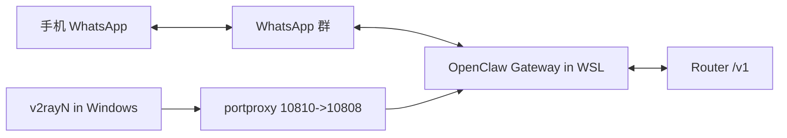

# OpenClaw 国内部署运行手册（Router + WhatsApp）

## 1. 总览架构



## 2. 必经步骤

1. 在 WSL 安装 Node + OpenClaw（版本锁定见 `versions.lock`）
2. 配置 Router 与 WhatsApp 策略（`scripts/configure_openclaw.sh`）
3. 应用 WhatsApp 兼容补丁（`scripts/apply_whatsapp_patch.sh`）
4. 扫码登录（`openclaw channels login --channel whatsapp --verbose`）
5. 自检（`scripts/verify.sh`）

## 3. 典型故障

- `405 Method Not Allowed`：通常是 WhatsApp Web 指纹兼容问题，先跑补丁脚本
- `503 所有供应商暂时不可用`：检查 `models.providers.router.api` 是否为 `openai-responses`
- `Failed to extract accountId from token`：通常是 API wire 模式配置错
- `not linked`：重新扫码登录

## 4. 日志与状态

```bash
openclaw channels status
openclaw channels logs --channel whatsapp --lines 120
openclaw gateway --token <GATEWAY_TOKEN> health
```

## 5. 文档主仓（v2rayN）

v2rayN 相关文档已迁移到 deployer：
- https://github.com/ShengNW/deployer/tree/main/middleware/v2ray/v2rayN
